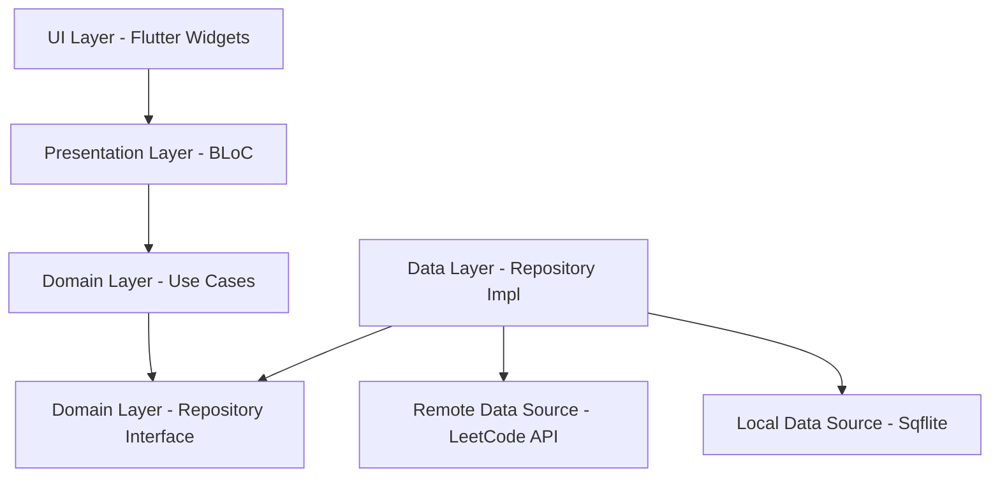

# Leet - LeetCode Progress Tracker 🚀

[](https://flutter.dev)
[](https://dart.dev)
[](https://blog.cleancoder.com/uncle-bob/2012/08/13/the-clean-architecture.html)
[)](https://bloclibrary.dev)

A comprehensive cross-platform application built with **Flutter** and **Clean Architecture** that helps developers track their LeetCode progress, compare with others, and visualize their coding journey through beautiful analytics and widgets.

## 📱 Screenshots

<div align="center">
  
  
  
</div>

<div align="center">
  
  
  
</div>

<div align="center">
  
  
  
</div>

<div align="center">
  
  
  
</div>

<div align="center">
  
  
  
</div>

## ✨ Features

### 📊 Dashboard & Analytics

- **Question Progress Tracking**: Visual representation of solved problems categorized by difficulty (Easy, Medium, Hard).
- **Activity Heatmap**: Contribution calendar showing daily coding activity.
- **Contest Performance**: Rating history and participation analytics.
- **Streak Tracking**: Current solving streak and total active days.
- **Recent Submissions**: Timeline of latest problem solutions.
- **Badges Collection**: Display of earned LeetCode achievements.

### 👥 User Comparison

- **Side-by-Side Comparison**: Compare progress between any two users.
- **Detailed Analytics**: Progress graphs for each difficulty level.
- **Activity Comparison**: Visual comparison of coding activity patterns.

### 🤖 AI Insights
- **Smart Analysis**: Personalized insights powered by Google Generative AI.
- **Performance Tips**: AI-driven suggestions to improve your coding consistency and ranking.

### 🔐 Authentication & User Management

- **Simple Authentication**: Easy sign-in process.
- **Multi-User Support**: Switch between multiple LeetCode profiles.
- **Data Persistence**: Local caching with Sqflite and Shared Preferences.

### 🎨 Modern UI/UX

- **Material Design 3**: Latest design system implementation.
- **Dark Theme**: Eye-friendly dark mode interface.
- **Smooth Animations**: Fluid transitions using Flutter animations.
- **Responsive Design**: Optimized for different screen sizes.

## 🏗️ Project Structure

```
lib/
├── app/                        # App configuration & constraints
├── core/                       # Core utilities (Error handling, Params, Resources)
├── data/                       # Data Layer
│   ├── datasources/            # Remote (API) & Local (DB) data sources
│   ├── models/                 # Data API models
│   └── repositories/           # Repository implementations
├── domain/                     # Domain Layer
│   ├── entities/               # Domain entities
│   ├── repositories/           # Repository interfaces
│   └── usecases/               # Business logic / Use cases
├── presentation/               # Presentation Layer
│   ├── blocs/                  # State management (BLoC)
│   ├── screens/                # UI Screens (Pages)
│   └── widgets/                # Reusable UI components
└── main.dart                   # Application entry point
```

## 🔄 Architecture

The app follows **Clean Architecture** principles with **BLoC** for state management:



## 🛠️ Tech Stack

### Core Technologies

- **Framework**: Flutter
- **Language**: Dart
- **Architecture**: Clean Architecture
- **State Management**: Flutter BLoC
- **Dependency Injection**: GetIt (Implicit via RepositoryProvider/BlocProvider hierarchy)

### Data & Networking

- **Networking**: Dio
- **Local Database**: Sqflite
- **Preferences**: Shared Preferences
- **JSON Serialization**: JSON Serializable

### UI & Design

- **Charts**: FL Chart
- **Calendar**: Flutter Heatmap Calendar
- **Shimmer**: Shimmer
- **Fonts**: Google Fonts

### AI Integration

- **Google Generative AI**: Gemini API for insights

## 🚀 Getting Started

### Prerequisites

- Flutter SDK (latest stable)
- Dart SDK
- Android Studio / VS Code

### Installation

1. **Clone the repository**
   ```bash
   git clone <repository-url>
   cd leet
   ```

2. **Install Dependencies**
   ```bash
   flutter pub get
   ```

3. **Run the app**
   ```bash
   flutter run
   ```

## 🤝 Contributing

Contributions are welcome! Please feel free to submit a Pull Request.

## 📄 License

This project is licensed under the Apache License 2.0.
